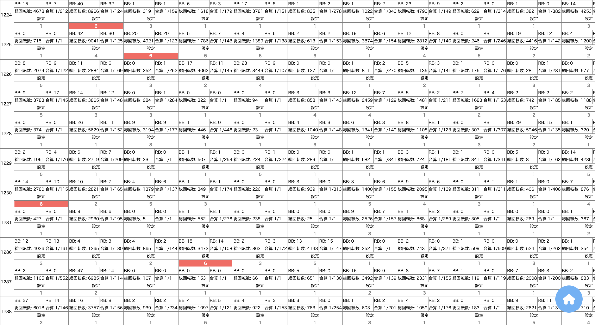

# Slot-Rec

## <a href="http://slot-rec.herokuapp.com/">Slot-Rec</a> とは

<a href="https://github.com/Reni-masa/slot-scraping">スクレイピング用アプリ</a>で取得・分析したデータの、参照用アプリケーション。

□ 機種一覧ページ(index)

□ 機種ごとのデータ一覧(show)

□ 台ごとのデータ詳細(detail)

## 使用技術

-   php(v7.3.24)
-   Laravel(v8.64.0)
-   javascript
-   mysql(cleardb)

## インフラ

-   heroku

## 今後の課題 memo

-   UI の向上
    -   show ページ - 日付と代番号の固定化
-   フロントを強化し、SPA 化
    -   フロントでの並び替え
    -   絞り込み
    -   取得日数の指定
-   機械学習による設定予測
    -   機械学習用アプリとして作成し、DB 格納
-   設定推測機能の切り出しを行い API 化、ユーザー入力による設定解析機能の追加
    -   <a href="https://github.com/Reni-masa/slot-scraping">スクレイピング用アプリ</a>から機能を切り取り、どこかに api 配置
